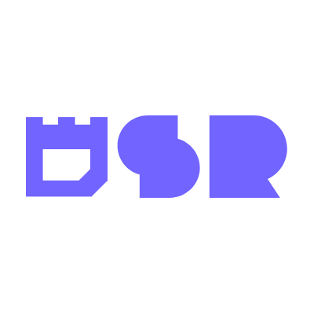

<p align="center"> 
    
</p>

<h1 align="center">
Domain Specific Relays (DSR)
</h1>

<br/>

This repository contains a set of [Nostr](https://nostr.com) relays designed to be used for specific purposes.

This project is based on [Khatru](https://github.com/fiatjaf/khatru), [Event Store](https://github.com/fiatjaf/eventstore), [Blob Store](github.com/kehiy/blobstore) and [Go Nostr](github.com/nbd-wtf/go-nostr).

Here is a list of DSRs developed by the Dezh:

1. [Zapoli](./zaploi): A relay designed to used by [NIP-82](https://github.com/nostr-protocol/nips/pull/1336) clients.
    - NIP-50: you can search between softwares.
    - Blossom: you can store software images, icons, and binaries.
    - NIP-86: you can limit write access to software publishers.

2. [210maxi](./210maxi): A relay that only accepts 210 character events, tuned for [NIP-B1](https://github.com/nostr-protocol/nips/pull/1710) feeds.
    - Only accept kind 25, 1111, 7, 5, 9734, 9735, 0, 3.
    - NIP-50: search your favorite tiny notes.
    - NIP-86: manageable with support of reportings. (WIP)

3. [Pages](./pages//): A relay that only keeps profiles and follow lists. You can simply resolve any pubkey from it. 
    - NIP-50: you can search profiles.
    - You can directly send your profile update/deletion to it.
    - It scrape new profiles.
    - Optional Blossom server to host profile pictures and banners.
    - NIP-86: Ban specific profiles/Check reported ones.

> [!NOTE]
> You can open your target relay and find full documentation there.

## Contribution

All kinds of contributions are welcome!

## Donation

Donations and financial support for the development process are possible using Bitcoin and Lightning:

**on-chain**:

```
bc1qa0z44j7m0v0rx85q0cag5juhxdshnmnrxnlr32
```

**lightning**: 

```
dezh@coinos.io
```

## License

These software are published under [MIT License](./LICENSE)
