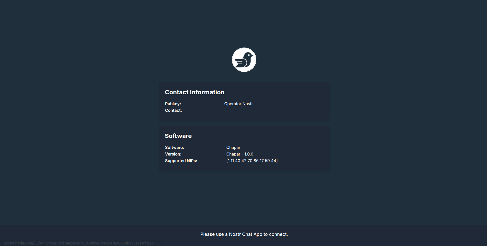

<p align="center"> 
    
</p>

<h1 align="center">
A nostr relay that only accepts chat app events!
</h1>

<br/>

The Chapar is designed only for chat apps based on nostr.

## Screenshot



## Features

- **Limited Kinds**: Only accepts kinds related and accepted in NIP-59.
- **Limited queries**: You need to auth before reading any events and you can only read events related to you.

## Installation

### Setup

Here's an adapted **Setup** section considering that you'll push the base image to **Docker Registry**, allowing users to pull and run it easily.

---

## **Installation**

### **Setup**

#### **Option 1: Use Prebuilt Docker Image (Recommended)**

The easiest way to run Chapar is by using the prebuilt image:

1. **Pull the latest image**

```sh
docker pull dezhtech/chapar
```

2. **Run Chapar with environment variables**

```sh
docker run -d --name chapar \
   -p 3334:3334 \
   -e RELAY_NAME="21maxi" \
   -e RELAY_PUBKEY="your_pubkey" \
   -e RELAY_DESCRIPTION="We only accept kin 1059 events!" \
   -e RELAY_URL="wss://chapar.com" \
   -e RELAY_ICON="https://your-icon-url.png" \
   -e RELAY_BANNER="https://your-banner-url.png" \
   -e RELAY_CONTACT="https://dezh.tech" \
   -e WORKING_DIR="chapar_wd/" \
   -e RELAY_PORT=":1717" \
   dezhtech/chapar
```

---

#### **Option 2: Using Docker Compose**

For a more structured deployment, use **Docker Compose**:

1. **use `compose.yml`**

use the exist compose file in the Chapar directory


2. **Run with Compose**
   ```sh
   docker-compose up -d
   ```

## Configuration

Modify the `env` variables in `.env` file, docker compose file or docker command to customize settings:

### Relay Metadata

- `RELAY_NAME` – The name of the relay (default: `chapar`).
- `RELAY_PUBKEY` – The owner's hex key (convert `npub` to hex [here](https://nostrcheck.me/converter/)).
- `RELAY_DESCRIPTION` – A short description of the relay.
- `RELAY_URL` – WebSocket URL for the relay (e.g., `wss://abc.com`).
- `RELAY_ICON` – URL to the relay's icon.
- `RELAY_BANNER` – URL to the relay's banner image.
- `RELAY_CONTACT` – Contact URL (e.g., `https://dezh.tech`).

### Storage & Working Directory

- `WORKING_DIR` – Configuration working directory (default: `chapar_wd`).

### Networking & Ports

- `RELAY_PORT` – Port on which the relay listens (default: `:1717`).

## Contributing

Pull requests are welcome! Feel free to open an issue if you have feature requests or find bugs.

## License

This software is published under [MIT License](../LICENSE).
