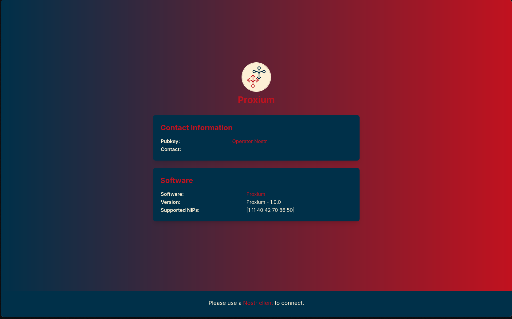

<p align="center"> 
    
</p>

<h1 align="center">
A Nostr relay that proxy your notes and other stuffs.
</h1>

<br/>

## Screenshot



## Features

- **Proxies Filters**: Fetch your query from multiple relays.
- **Proxies Events**: Sends your events to other relays.


## Installation

### Setup

Here's an adapted **Setup** section considering that you'll push the base image to **Docker Registry**, allowing users to pull and run it easily.

---

## **Installation**

### **Setup**

#### **Option 1: Use Prebuilt Docker Image (Recommended)**

The easiest way to run Pages is by using the prebuilt image:

1. **Pull the latest image**

   ```sh
   docker pull dezhtech/proxium
   ```

2. **Run Pages with environment variables**
   ```sh
   docker run -d --name proxium \
   -p 3334:3334 \
   -e RELAY_NAME="proxium" \
   -e RELAY_PUBKEY="your_pubkey" \
   -e RELAY_DESCRIPTION="We proxy your notes and other stuffs." \
   -e RELAY_URL="wss://example.com" \
   -e RELAY_ICON="https://file.nostrmedia.com/f/bd4ae3e67e29964d494172261dc45395c89f6bd2e774642e366127171dfb81f5/4ba621f11b122afd4aa07a5c00f7d18d14572f61035f397839ec5ac6a400c946.png" \
   -e RELAY_BANNER="https://file.nostrmedia.com/f/bd4ae3e67e29964d494172261dc45395c89f6bd2e774642e366127171dfb81f5/be5b462b3fe0d2d24d0a96147b4e15a6e3f6e3d5d39da7d3130d196e5a066968.png" \
   -e RELAY_CONTACT="https://example.com" \
   -e WORKING_DIR="proxium_wd/" \
   -e RELAY_PORT=":3334" \
   -e ADMIN_PUBKEYS="" \
   -e MODERATOR_PUBKEYS="" \
   -e WRITE_FALLBACK_RELAYS="nos.lol,purplepag.es,relay.nostr.lol,jellyfish.land,relay.primal.net,nostr.mom,nostr.wine,nostr.land" \
   -e READ_FALLBACK_RELAYS="nos.lol,purplepag.es,relay.nostr.lol,jellyfish.land,relay.primal.net,nostr.mom,nostr.wine,nostr.land" \
   dezhtech/proxium
   ```

---

#### **Option 2: Using Docker Compose**

For a more structured deployment, use **Docker Compose**:

1. **use `compose.yml`**
use the exist compose file in the pages directory


2. **Run with Compose**
   ```sh
   docker-compose up -d
   ```

## Configuration

Modify the `env` variables in `.env` file, docker compose file or docker command to customize settings:

### Relay Metadata

- `RELAY_NAME` – The name of the relay (default: `pages`).
- `RELAY_PUBKEY` – The owner's hex key (convert `npub` to hex [here](https://nostrcheck.me/converter/)).
- `RELAY_DESCRIPTION` – A short description of the relay.
- `RELAY_URL` – WebSocket URL for the relay (e.g., `wss://abc.com`).
- `RELAY_ICON` – URL to the relay's icon.
- `RELAY_BANNER` – URL to the relay's banner image.
- `RELAY_CONTACT` – Contact URL (e.g., `https://dezh.tech`).

### Storage & Working Directory

- `WORKING_DIR` – Configuration working directory (default: `pages_wd`).

### Networking & Ports

- `RELAY_PORT` – Port on which the relay listens (default: `:3334`).

### Admin Access Control

- `ADMIN_PUBKEYS` – Comma-separated list of allowed public keys that can call management APIs.
- `MODERATORS_PUBKEYS` – Comma-separated list of allowed public keys that can remove events from db by sending kind 1984 events.

## Contributing

Pull requests are welcome! Feel free to open an issue if you have feature requests or find bugs.

## License

This software is published under [MIT License](../LICENSE).
